# Optimizacija ruta u videoigrama: modeliranje grafova za pronalazak optimalnih putova NPC-ova u videoigrama u stvarnom vremenu

# 1. Uvod
Mnogi se problemi u domeni informatike i znanosti mogu generalizirati kao pronalaženje puta u grafovima.
Algoritmi pretraživanja su stoga vrlo bitni.
Primjeri problema koja možemo riješiti pomoću tih algoritama su:

- navigacija i prostorna orijentcija

- video igre

- telekomunikacijske mreže

- logistika i tranport

- urbanističko planiranje

- robotika

- dizajn tiskanih ploča

 
Graf je skup čvorova povezanih međusobno pomoću bridova. 
U nekim je problemima potrebno uz čvor dodati i neku vrijednost koja označava njegovu težinu. Na primjer možemo razmišljatu o problemu pronalaska puta između gradova. Svaki grad je čvor u grafu i svaka cesta koje povezuje gradove je brid u grafu. Tada možemo uz čvor dodati i broj koji predstavlja udaljenost između gradova. Možemo si postaviti pitanje koji je najbrži put od jednog do drugog. Jedan način na kojem bismo to mogli učiniti je taj da pogledamo sve mogućnosti koje su nam dostupne. Taj algoritam nebi bio brz i efikasan jer bi trošio računalne i memorijske resurse u ne optimalne smijerove. Postoji bolji način za riješavanje tih problema poput algoritama za pretraživanje. U ovom ćemo radu detaljnije pogledati A* algoritam za pretraživanje.

Za potrebe rada razvili smo simulaciju igrice u Pythonu u kojoj koristimo A* algoritam za pronalaženje najkraćeg puta od početne do krajnje točke. U simulaciju je moguće dinamički dodati razna polja karakterizirana po brzini kretanja i prepreka. Za prikaz mape koristimo 2D vizualizaciju mreže u kojoj se igrač može kretati samo u vodoravnom i okomitom smjeru. Svaka ćelija mape predstavlja čvor u našem grafu i sve su susjedne čelije međusobno povezane.
Kod svake promjene na mapu koristmo A* algoritam kako bismo pronašli najbrži put od trenutne pozicije igrača do krajnjeg cilja.

## Pregled poglavlja

### 2. A* algoritam

- Definirati ćemo **osnovne pojmove vezane s grafom**:
    1. vrhovi, odnosno čvorovi i bridovi grafa,
    2. šetnja u grafu,
    3. staza i put,
    4. povezanost čvorova,
    5. nasljednik čvora,
    6. težina puta.

- Objasniti ćemo bazu A* algoritma, odnosno **Dijkstra's algorithm**:
    1. osnovna ideja,
    2. mogući problemi kod Dijkstrinog algoritma.

- Objasniti ćemo sam **A*** **algoritam**:
    1. definicija,
    2. prednosti u odnosu na Dijkstrin algoritam,
    3. osnovni uvod u heuristiku A*-a,
    4. mogući problemi kod neispravno odabrane heuristike.

### 3. Heuristika

- Definirati ćemo detaljnije **heuristiku** i objasniti **njenu primjenu u A***:
    1. definicija,
    2. par heuristika za A*.

### 4. Simulacija

- Ukratko ćemo opisati video igru za simuliaciju pathfindinga razvijenu u Pythonu:
    1. značajke video igre,
    2. informacije vezane za izračun najkraćeg puta i potrebno vrijeme za njegov izračun,
    3. screenshotovi video igre.

### 5. Zaključak

### 6. Literatura

# 2. A* algoritam

## Osnovni pojmovi

**Definicija 2.1.** ***Graf*** *$G$ je uređena trojka $G = (V(G), E(G), \psi_G)$, koja se sastoji od nepraznog skupa $V = V(G)$, čiji su elementi vrhovi grafa $G$, skupa $E = E(G)$ disjunktnog sa $V(G)$, čiji su elementi bridovi grafa $G$, i funkcije incidencije $\psi_G$, koja svakom bridu grafa $G$ pridružuje neuređeni par (ne nužno različitih) vrhova grafa $G$.*

**Primjer 1.1.** Graf $G = (V, E, \varphi)$, gdje je $V = \{A, B, C, D, E\}$ s bridovima $E = \{e_1, e_2, e_3, e_4, e_5, e_6\}$. Funkcija incidencije tada bi bila:
$\varphi(e_1) = \{A, B\}, \varphi(e_2) = \{B, C\}, \varphi(e_3) = \{C, D\},  \varphi(e_4) = \{D, E\}, \varphi(e_5) = \{D, B\}, \varphi(e_6) = \{A, E\}$

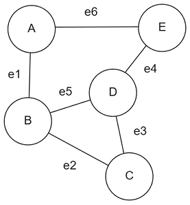


**Definicija 2.3.** ***Šetnja*** *u grafu $G$ je netrivijalan konačan niz $W = v_0 e_0 v_1 e_1 \dots e_{k-1} v_k$ vrhova i bridova u $G$ takvi da je $e_i = \{v_i, v_{i+1}\}$ za sve $i < k$.*

**Definicija 2.4.** *Neka je $W = v_0 e_0 v_1 e_1 \dots e_{k-1} v_k$ šetnja u grafu $G$. Ako su u šetnji $W$ svi bridovi međusobno različiti, tada $W$ zovemo **staza**. Ako su svi vrhovi u šetnji međusobno različiti, onda šetnju $W$ zovemo **put.***

**Definicija 2.5.** *Kažemo da su dva čvora $u, v \in V$ **povezani** $\Leftrightarrow$ postoji put $P$ između $u$ i $v$.*

**Definicija 2.6.** *Neka je $P$ put između dva čvora $u, v \in V$, a neka je $n$ čvor koji se nalazi na putu. Kažemo da je $n'$ **nasljednik čvora** $n$ ako je $(n, n') \in P$, tj. ako pratimo put $P$, sljedeći čvor koji bismo posjetili nakon što stignemo do $n$ bio bi $n'$.*

**Definicija 2.7.** *Ako je $u \in V$, definiramo **povezanu komponentu čvora** $u$ kao*
$$C_u = \{v \in V \mid u \text{ i } v \text{ su povezani}\}$$
*što je podgraf grafa $G$.*

**Definicija 2.8** *Neka je $G = (V, E)$ težinski graf s težinskom funkcijom $w : E(G) \to \mathbb{R}$ i neka je $p = v_0 e_0 v_1 e_1 \dots e_{k-1} v_k$ put u grafu $G$. **Težina puta** $p$ definira se kao suma svih težina bridova koji su sadržani u putu:*
$$w(p) = \sum_{i=1}^{k-1} w(e_{i-1}, e_i)$$

**Definicija 2.9.** ***Težina najkraćeg puta** $\delta(u, v)$ između vrhova $u, v \in V(G)$ definira se kao:*
$$
\delta(u, v) =
\begin{cases}
\min\{w(p) : p \text{ put od } u \text{ do } v\}, & \text{ako postoji put od } u \text{ do } v \\
\infty, & \text{inače}
\end{cases}
$$
Najkraći put od vrha $u$ do vrha $v$ tada je definiran kao bilo koji put $p$ s težinom $w(p) = \delta(u, v)$.


**Definicija 2.10.** *Ako algoritam $A$ uvijek pronađe optimalni put između izvornog čvora i preferiranog ciljnog čvora, kažemo da je $A$ prihvatljiv.*

**Definicija 2.11.** *Neka je izvorni čvor i skup ciljanih čvorova u grafu $G = (V, E)$. Definiramo ocjenu kao funkciju $f : V \to \mathbb{R}$ definiranu kao*
$$f(u) = g(u) + h(u)$$
*gdje je $g(u)$ procjena optimalne udaljenosti od izvornog čvora do čvora $u$, a $h(u)$ procjena optimalne udaljenosti od čvora $u$ do jednog od njegovih preferiranih ciljnih čvorova. Obično nazivamo $g$ g-ocjena, a $h$ h-ocjena.*

## Dijkstrin algoritam

Da bismo mogli razumjeti pathfinding algoritam A*, prvo moramo razumjeti algoritam na kojem je A* baziran - odnosno ***Dijskstra's algorithm***.

Dijkstrin algoritam je algoritam za pronalaženje najbržeg puta od početnog čvora do bilo kojeg drugog čvora u grafu koristeći *težinu bridova* između susjednih čvorova. Algoritam traži najkraći put tako da uvijek bira čvorove čiji su povezani bridovi najmanje *težine*, a zatim istražuje njegove susjede. Ovaj se postupak ponavlja sve dok se ne pronađe najkraći put od početnog čvora do cilja. 

### Osnovna ideja Dijkstra algoritma

Osnovna ideja algoritma je sljedeća:

1. Počinjemo od početnog vrha i obilazimo njegove susjede. Svakom susjedu pridruži privremenu udaljenost koja je jednaka težini brida između tog susjeda i početnog vrha.

2. Zatim biramo vrh s najmanjom privremenom udaljenošću i označavamo ga kao trenutni vrh, dok početni vrh označavamo kao posjećen.

3. Algoritam se zatim izvodi na trenutnom vrhu, pri čemu se ažuriraju privremene udaljenosti za njegove neposjećene susjede. Nakon toga, trenutni vrh postaje posjećen.

4. Nakon toga, biramo vrh koji ima najmanju privremenu udaljenost među svim neposjećenim vrhovima i postavljamo ga kao novi trenutni vrh.

5. Ovaj proces se ponavlja dok ne posjetimo sve vrhove u grafu.

6. Pri svakom ažuriranju privremene udaljenosti susjeda trenutnog vrha, pamti se prethodnik (tj. čvor iz kojeg smo došli do tog susjeda). Na taj način, kada neki vrh postane posjećen, možemo rekonstruirati najkraći put od početnog vrha prema tom vrhu, prateći prethodnike od ciljnog vrha do početnog.

### Implementacija
```python
def rekonstruiraj_put(prev, cilj):
    put = []
    trenutni = cilj
    
    while trenutni is not None:
        put.insert(0, trenutni)
        trenutni = prev.get(trenutni)
    
    return put

def dijkstra(graph, source, cilj):
    dist = {v: float('inf') for v in graph}
    prev = {v: None for v in graph}
    dist[source] = 0
    
    Q = list(graph.keys())  # Lista svih čvorova
    
    while Q:
        min_dist = float('inf')
        u = None

        # Odabir čvora s najmanjom trenutnom udaljenosti
        for vrh in Q:
            if dist[vrh] < min_dist:
                min_dist = dist[vrh]
                u = vrh
        
        Q.remove(u)
        
        if u == cilj:
            return rekonstruiraj_put(prev, cilj)
        
        for v, tezina in graph[u].items():
            alt = dist[u] + tezina
            if alt < dist[v]:
                dist[v] = alt
                prev[v] = u
    
    return None  # Neuspjeh ako nema puta

# Primjer korištenja
graph = {
    'A': {'B': 1, 'C': 4},
    'B': {'A': 1, 'C': 2, 'D': 5},
    'C': {'A': 4, 'B': 2, 'D': 1},
    'D': {'B': 5, 'C': 1}
}

source = 'A'
cilj = 'D'
put = dijkstra(graph, source, cilj)
print("Najkraći put:", put)

```

### Primjer

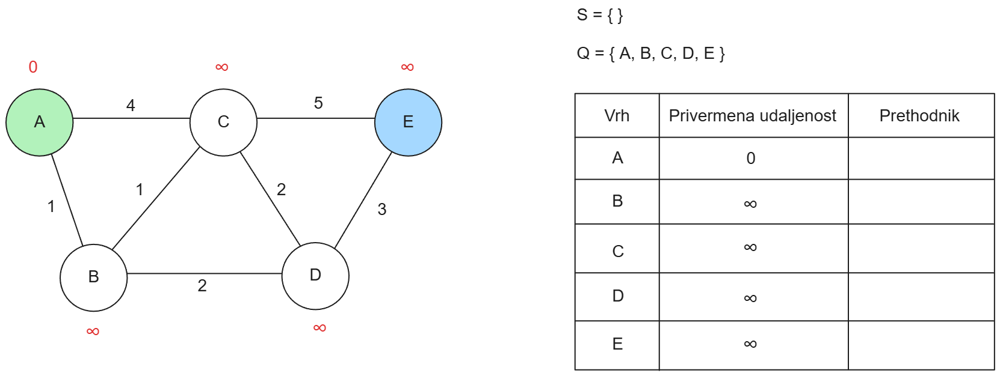
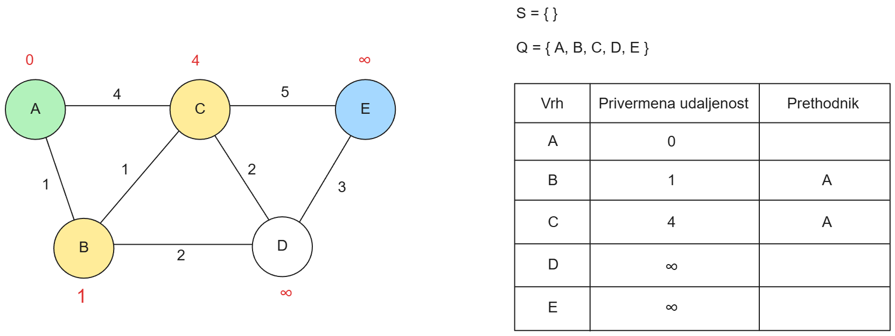
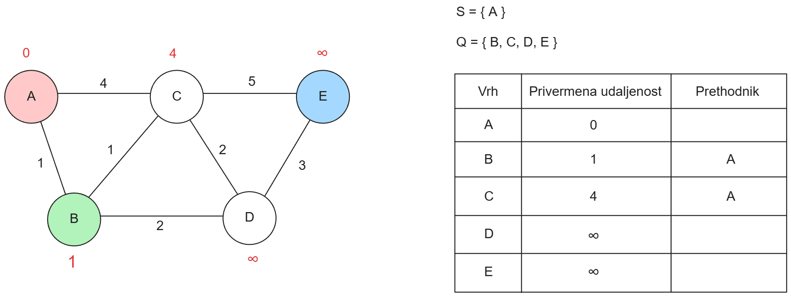
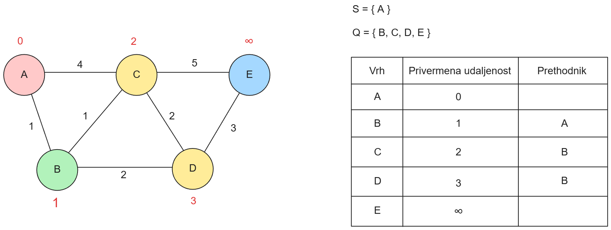
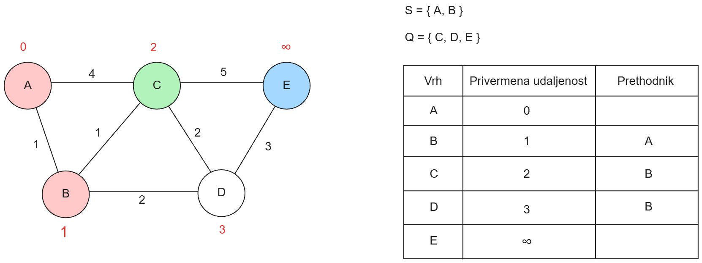
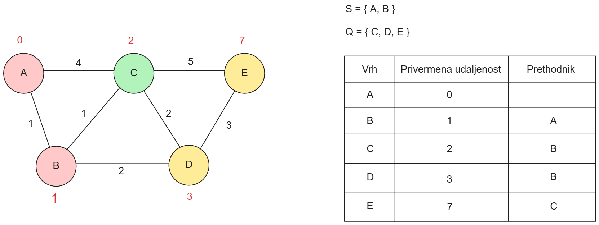
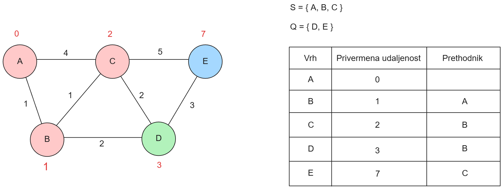
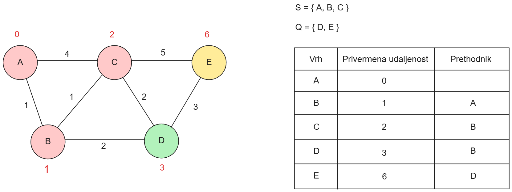
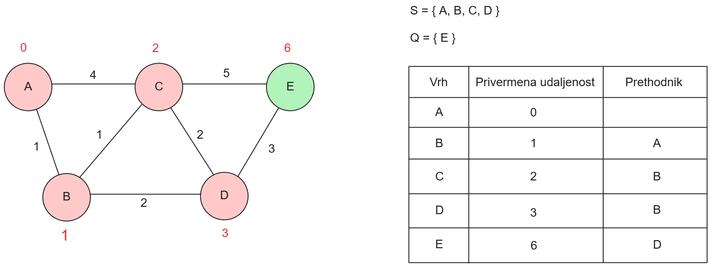

Kad smo u zadnjem koraku odabrali kao trenutni vrh nas cilj završili smo algoritam.
Prateći prethodnike ciljnog brha dobivamo najkraći put:

$$ A \rightarrow B \rightarrow D \rightarrow E $$


S Dijkstrinim algoritmom moramo biti oprezni kada imamo graf u kojemu je cilj povezan s čvorovima koji imaju *velike* težine ili barem težine *veće* od čvorova koji se nalaze *dalje* od cilja: 


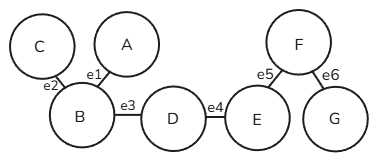

Ako počinjemo od čvora $A$ i cilj nam je čvor $C$ i ako je brid $e_2$ *teži* od bridova $e_3,e_4,e_5$ i $e_6$, Dijkstrin algoritam će $e_2$ zadnje provjeriti u cijelom grafu $H$, odnosno provjeravati će bespotrebno sve ostale čvorove. U ovom primjeru to možda nije veliki problem, ali ako uzmete npr. primjenu pathfinding algoritama na navigacijskim sustavima, tada ovo postaje veliki problem zato jer algoritam neće uzeti u obzir *smjer* u kojem treba *šetati*. Rezultat toga je bespotrebno pretraživanje i *šetanje* po nebitnim čvorovima što zauzvrat produžuje vrijeme izračuna najbržeg puta, uz bespotrebnu uporabu računalnih resursa itd.

Zbog tih razloga razvijen je A*, algoritam baziran na Dijkstrinom algoritmu, ali s dodanom funkcijom **heuristike**.

## A* definicija

A* algoritam ili algoritam usmjerenog pretraživanja je pathfinding algoritam koji 
kombinira funkcionalnost Dijksrinog algoritma s dodatkom heuristička funkcije. 
Pomoću heurističke funkcije, algoritam ima *"smisao smjera"*, odnosno uzima u obzir
preostalu udaljenost u računu težine puta:

$$f(p) = \sum_{i=1}^{k-1} w(e_{i-1}, e_i) + h(v_k)$$

gdje je:

- $f(p)$ ukupna težina puta p s heuristikom,
- $h(v_k)$ heuristička funkcija za čvor $v_k$, koja označava preostalu udaljenost od trenutnog čvora $v_k$ do cilja.

Ovim A* je brži od Dijkstrinog, ali pouzdano pronalazi optimalne putanje samo pod određenim uvjetom.

**Definicija 2.12.** *Heuristika h se smatra prihvatljivom ako i samo ako, za svaki $u ∈ V, h(u)$ nikada ne precjenjuje stvarni trošak kretanja od $u$ do preferiranog ciljnog čvora, tj. $∀u ∈ V, h(u) ≤ \hat{h}(u).$*

Stvarni trošak $\hat{h}(u)$ predstavlja najmanju moguću (optimalnu) cijenu puta od čvora $𝑢$ do ciljnog čvora. To znači da prihvatljiva heuristika uvijek daje procjenu koja je manja ili jednaka stvarnom minimalnom trošku, čime se osigurava da pretraga A* pronađe optimalno rješenje.

Ako heuristika nije prihvatljiva, to znači da može doći do precjenjivanja stvarnog troška kretanja od trenutnog čvora do cilja. U tom slučaju, algoritam može donijeti pogrešne odluke prilikom odabira puta, jer će heuristika pretpostaviti manji trošak nego što zapravo postoji, što može rezultirati neoptimalnim ili čak pogrešnim rješenjem.

Na primjer, u A* algoritmu, ako heuristika precjenjuje stvarni trošak, algoritam može izabrati put koji izgleda bolje zbog manjih procjena troškova, ali koji zapravo nije najkraći. To može dovesti do toga da A* algoritam ne pronađe optimalnu putanju ili bude sporiji nego što bi bio s prihvatljivom heuristikom.

Kada bi za heurističku funkciju uzeli $h(v) = 0$, A* se svodi na Dijkstrin algoritam.


# 3. Heuristika
Slijepi postupci raspolažu isključivo egzaktnim informacijama na primjer početnim i trenutnim stanjem i ispitnim predikatom. Možemo poboljšati i ubrzati riješavanje problema ako uz te informacije koristimo i informacije o prirodi problema. Ako otprilike znamo smjer u kojim se nalazi riješenje možemo koristiti tu informaciju u našu korist.

Heuristika je postupak, koji pomoću iskustvena pravila o prirodi problema i osobinama cilja, vodi prema otkriću ili ga potiče.

Za sliku 1 i 2, za funkciju heuristike možemo koristiti doslovnu udaljenost, odnosno euklidsku udaljenost između dva čvora.

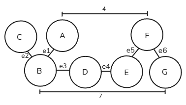

**Primjer:** za funkciju heuristike $h(v_k)$ od početnog čvora $B$ do ciljanog čvora $G$, funkcija će izgledati:

$$h(B)=7$$

U simulaciji kao heuristiku koristit ćemo udaljenost trenutnog čvora i odabranog cilj.
Kako bismo računali udaljenost između dva čvora možemo koristiti razne metode npr.:
- **Euklidska udaljenost (Euclidean distance)**:  
  Ovo je najčešći način izračunavanja udaljenosti u prostoru kada imamo dva čvora s koordinatama $(x_1, y_1)$ i $(x_2, y_2)$.  
  Formula:  
  $$
  d = \sqrt{(x_2 - x_1)^2 + (y_2 - y_1)^2}
  $$  
  Koristi se kada želimo izračunati stvarnu udaljenost između dvaju čvorova u ravnini.

- **Menhetanska udaljenost (Manhattan distance)**:  
  Ova udaljenost se koristi kada se dopuštaju samo horizontalna i vertikalna kretanja (kao u mreži kvadrata, bez dijagonala).  
  Formula:  
  $$
  d = |x_2 - x_1| + |y_2 - y_1|
  $$  
  Ovaj način je koristan kada ne možete kretati dijagonalno, kao što je slučaj u mrežama poput tih u računalnim igrama.

- **Čebiševljeva udaljenost (Chebyshev distance)**:  
  Ova udaljenost je pogodna za kretanje u mreži gdje je dopušteno kretanje u svim smjerovima (i dijagonalno).  
  Formula:  
  $$
  d = \max(|x_2 - x_1|, |y_2 - y_1|)
  $$  
  Ova udaljenost je korisna u igrama ili problemima gdje su svi smjerovi jednako dopušteni, uključujući dijagonale.

Po **Definicija 2.12** sve su tri udaljenosti kao heuristike prihvatiljive u simulaciji jer ne precjenjuju udaljenost u 2D mreži.

Kako možemo vidjeti sa simulacije vrijeme izvoženja algoritma ovisan je o odabiru heuristike.

Pošto smo razvili igricu u 2D mreži u kojoj je dozvoljeno se kretati samo horizontalno i vertikalno, za funkciju heuristike $h(v_k)$ **Manhattan distance** ili **Menhetanska udaljenost** najbolje procijenjuje udaljenost i zbog toga nam daje bolje performanse jer istražuje najmanji broj čvorova.


# 4. Simulacija

Razvili smo igricu u Pythonu pomoću paketa Pygame u kojoj korisnik može postaviti početnu točku (na kojoj se nalazi igrač), cilj, prepreke i polja s različitim "težinama" na gridu veličine 40x30. Implementirani A* algoritam izračunava najkraći put uzimajući u obzir prepreke i polja s povećanom težinom te biti će prikazan na gridu.

Korisnik može pokrenuti simulaciju kretanja igrača po izračunatom putu, pomagati igraču da dođe do cilja ili postavljati prepreke dok se igrač još miče. Možemo u *real time-u* vidjeti kako algoritam izračunava put u odnosnu na nove prepreke/polja s povećanom težinom. Također, korisnik može po potrebi zaustaviti simulaciju kretanja.

Korisnik može obrisati sve prepreke i polja s većim težinama ili nasumično postaviti prepreke po gridu jednim klikom.

Sa desne stane korisnik može izabrati sa kojom heuristikom će se izračunati put, odabir je izmđu Euklidske udaljenosti, Menhetanske udaljenosti i Čebiševljeve udaljenosti.
Za potrebe ove simulacije smo kao zadanu vrijednost postavili Menhetansku udaljenost kako najviše odgovara potrebama simulacije.

U donjem desnom kutu programa prikazani su podaci o vremenu (u ms) potrebnom za izračunavanje najkraćeg puta, kao i ukupni trošak (cost), koji predstavlja sumu težina svih koraka na najkraćem putu. Težine polja su: zeleno polje ima težinu 1, bež polje težinu 2 a narančasto polje težinu 3.

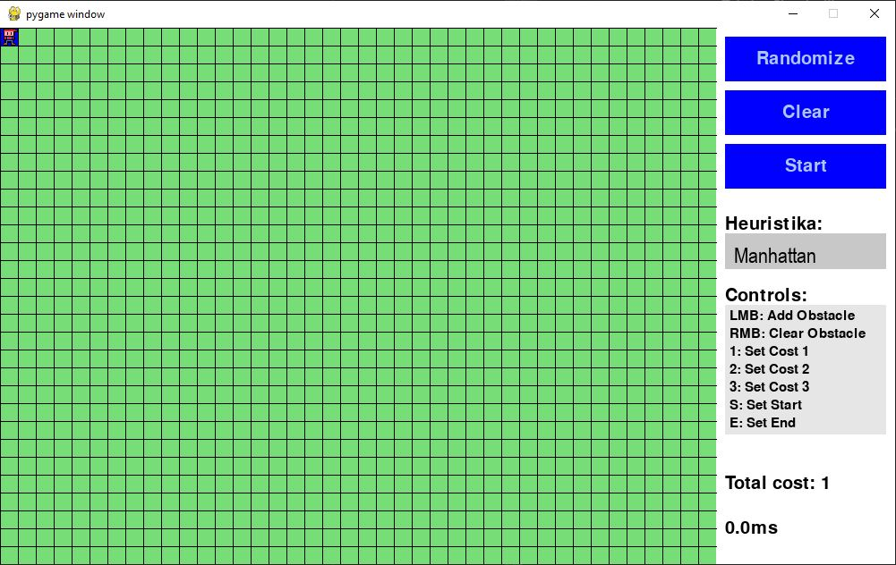


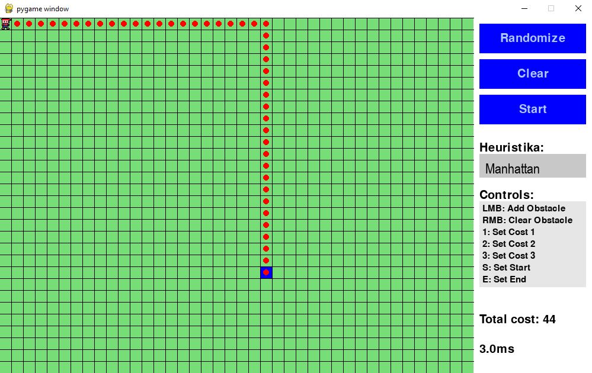

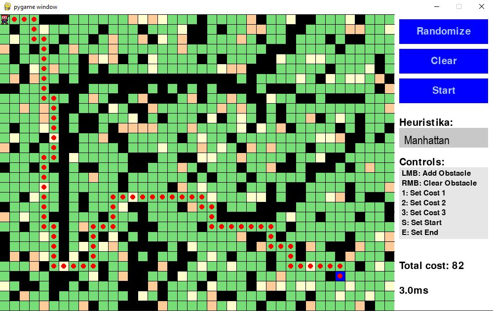


# 5. Zaključak

A* algoritam je vrlo moćan pathfinding algoritam koncepiran na bazi Dijkstrinog algoritma s dodanom heurističkom funkcijom radi bržeg i učinkovitijeg pronalaženja najkraćeg puta. Heuristika A* algoritma ovisi o prirodi problema kojeg se pokušava rješiti pomoću pathfindinga, te pokazali smo par od mnogobrojnih mogućnosti odabira heuristika. Kroz našu simulaciju pathfindinga u video igri možete vidjeti primjer primjene A* s Menhetanovom, Euklidskom i Čebiševljevom heuristikom.

Iz ovog projekta možemo zaključiti da primjena A* algoritma s pravilno odabranom heurističkom funkcijom rezultira vrlo moćinm i učinkovitim rješenjem za pronalaženje puta, što ga čini primjenjivim u različitim područjima - od računalnih igara do navigacijskih sustava i robotike.

# 6. Literatura

[1] Computerphile, *Dijkstra's algorithm*, YouTube, 4. siječnja 2017. [Online]. Dostupno: https://www.youtube.com/watch?v=Te5xC2F1JXg. [Pristupljeno: 14. siječnja 2025.]

[2] Computerphile, *A** *(A Star) search algorithm*, YouTube, 15. veljače 2017. [Online]. Dostupno: https://www.youtube.com/watch?v=ySN5Wnu88nE. [Pristupljeno: 14. siječnja 2025.]

[3] *Heuristic*, Wikipedia, 22. siječnja 2025. [Online]. Dostupno: https://en.wikipedia.org/wiki/Heuristic. [Pristupljeno: 14. siječnja 2025.]

[4] D. M. Laparra, *Pathfinding algorithms in graphs and applications*, Departament de Matemàtiques i Informàtica Barcelona, 15. siječnja 2019. [Online]. Dostupno: https://diposit.ub.edu/dspace/bitstream/2445/140466/1/memoria.pdf. [Pristupljeno: 17. siječnja 2025.]

[5] F. Vuković, *Algoritmi najkraćeg puta na grafovima i njihova primjena u cestovnoj navigaciji*, Sveučilište J. J. Strossmayera u Osijeku, Odjel za matematiku, 2020. [Online]. Dostupno: https://www.mathos.unios.hr/~mdjumic/uploads/diplomski/VUK39.pdf. [Pristupljeno: 17. siječnja 2025.]
